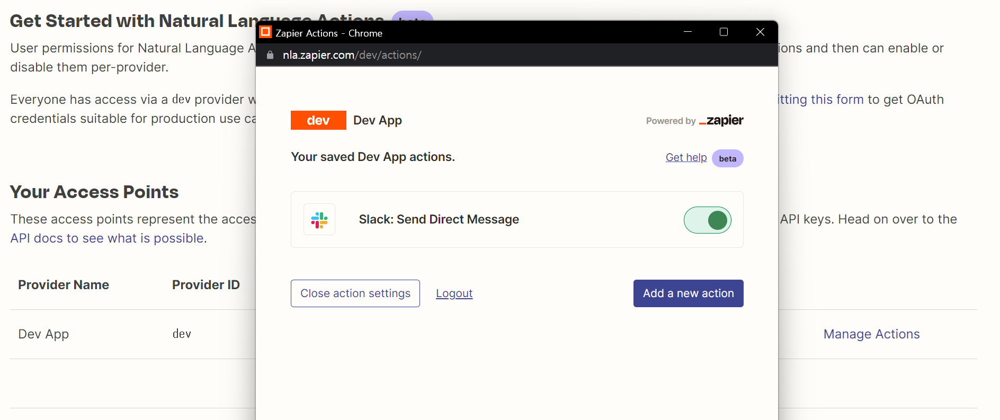
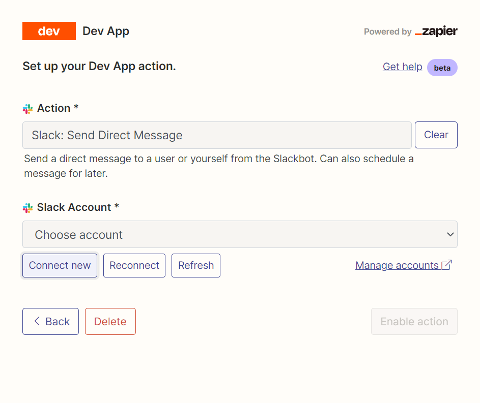
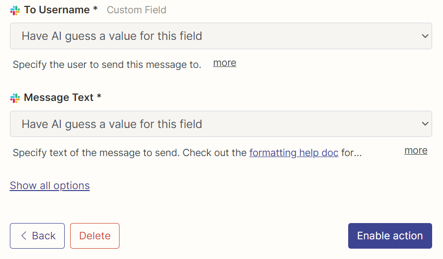
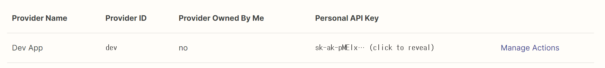

# Auto-GPT-Zapier

See `demo.ipynb` for example usage.

### Zapier Setup

1. Sign up to Zapier
2. Go to https://nla.zapier.com/get-started/, click `Manage Actions`, then click `Add a new action`
   
3. Search for action then click `Connect new` to connect app.
   
4. Click `Enable action`
   
5. Copy personal api key and add it to `.env` file
   ```
   ZAPIER_NLA_API_KEY=sk-ak-...
   ```
   


### Plugin Installation Steps

1. **Clone or download the plugin repository:**
   Clone the plugin repository, or download the repository as a zip file.
  
   

2. **Install the plugin's dependencies (if any):**
   Navigate to the plugin's folder in your terminal, and run the following command to install any required dependencies:

   ``` shell
      pip install -r requirements.txt
   ```

3. **Package the plugin as a Zip file:**
   If you cloned the repository, compress the plugin folder as a Zip file.

4. **Copy the plugin's Zip file:**
   Place the plugin's Zip file in the `plugins` folder of the Auto-GPT repository.

5. **Allowlist the plugin (optional):**
   Add the plugin's class name to the `ALLOWLISTED_PLUGINS` in the `.env` file to avoid being prompted with a warning when loading the plugin:

   ``` shell
   ALLOWLISTED_PLUGINS=example-plugin1,example-plugin2,example-plugin3
   ```

   If the plugin is not allowlisted, you will be warned before it's loaded.
